It is with great enthusiasm that my friend, Pratyush Prasad, and I present our collaborative endeavor: Social Sync, a dynamic social media application crafted entirely using Kotlin. As a passionate student developer, I embarked on this journey to explore the realms of mobile app development and create a platform that resonates with modern social networking trends.

Social Sync encapsulates a range of features synonymous with leading social media platforms, including:
1. Splash Screen
2. Sign Up and Login
3. Home Page
4. Search Feature
5. Editable Profile
6. Like, & Share Feature
7. Uploading and Posting
8. Follow Feature
   
here's a comprehensive technology stack of our app:
1.API Integration:
Utilize Firebase for server-side functionalities, including authentication, database (Firestore), and storage.
2.Adapters:
Utilize RecyclerView adapters for efficiently managing and displaying lists of content such as posts, reels, and user profiles.
3.Material Design Components:
Leverage Material Components for Android to ensure consistent UI/UX design throughout the app, including Material Toolbar for navigation and action items.
4.Iconography:
Incorporate Flaticons for a visually appealing and cohesive set of icons across the app's interface.
5.Image Loading:
Utilize Glide library for efficient image loading, caching, and displaying within RecyclerViews and user profiles.
6.Time Formatting:
Integrate Marlon Lomeli's TimeAgo library for convenient and dynamic time formatting, enabling relative timestamps for content (e.g., "2 hours ago").
7.Custom UI Components:
Implement custom ScrollView for enhanced scrolling behavior and user experience, ensuring smooth navigation through feeds and profiles.
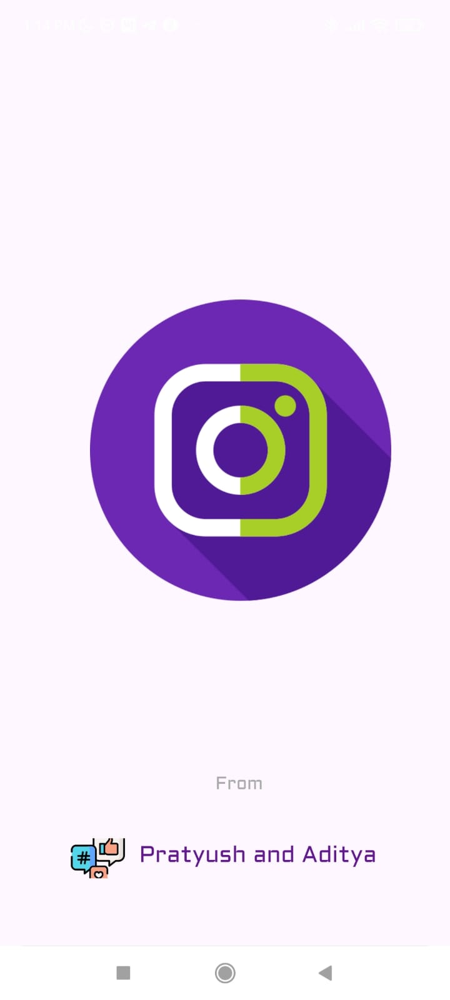
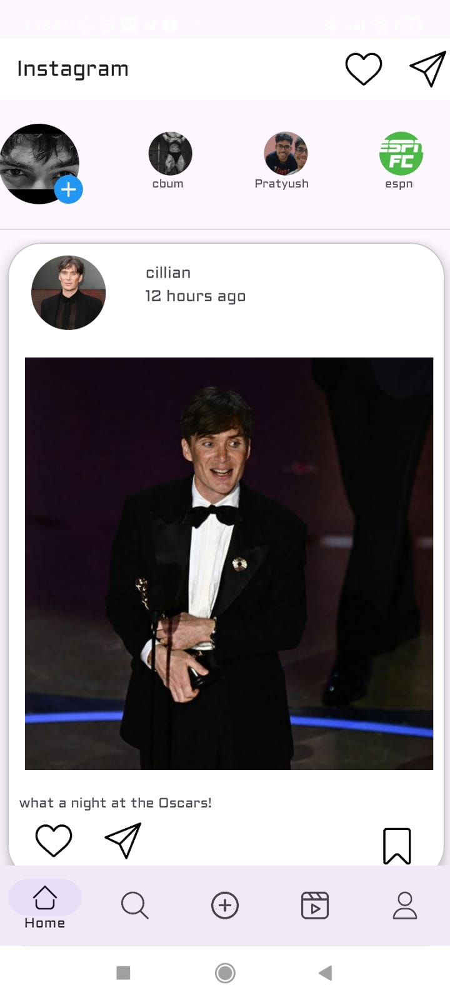
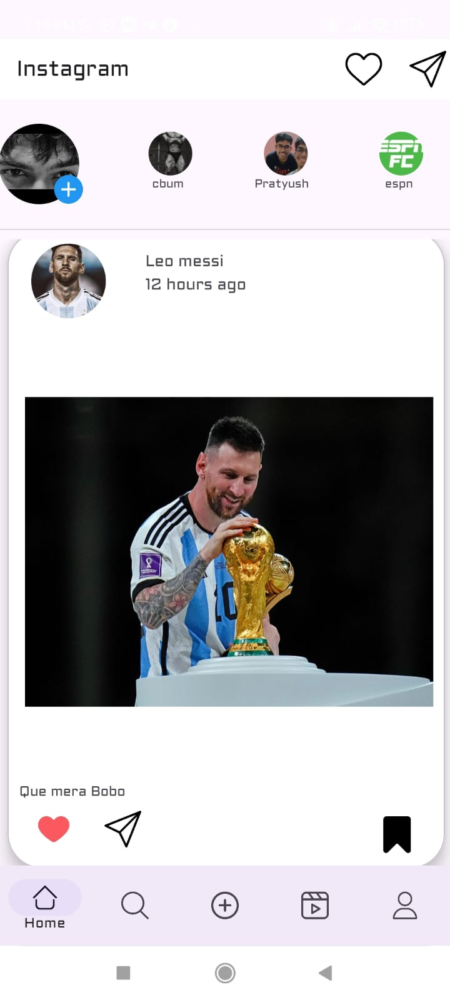
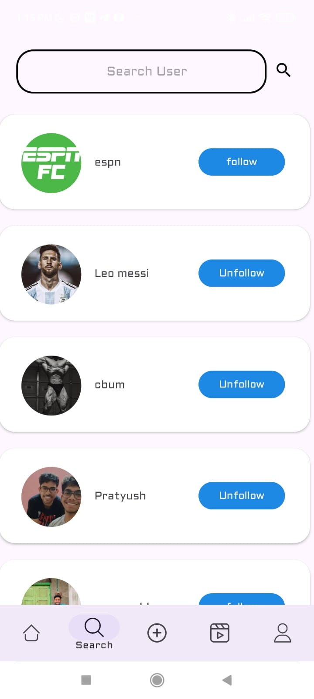
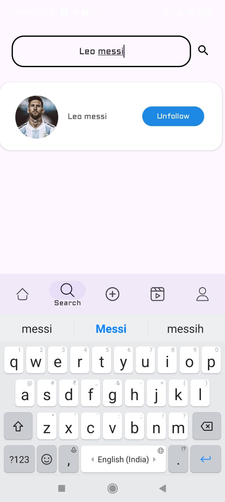
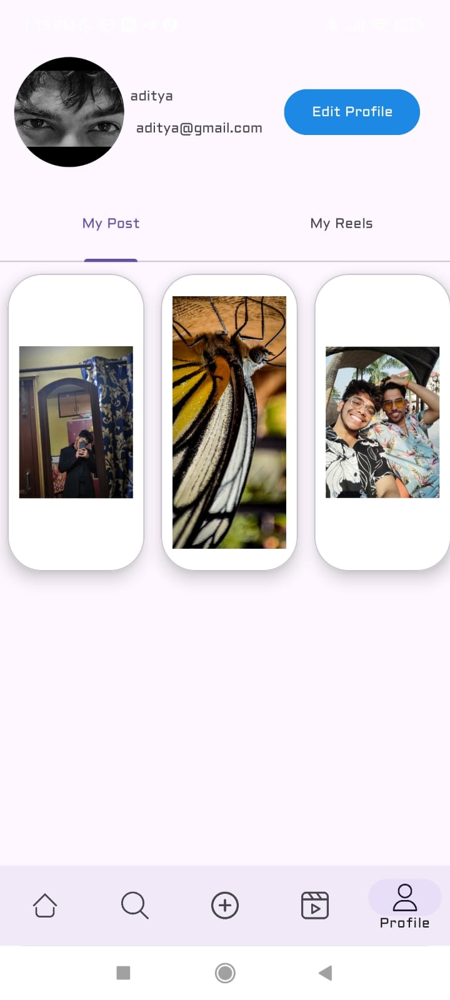
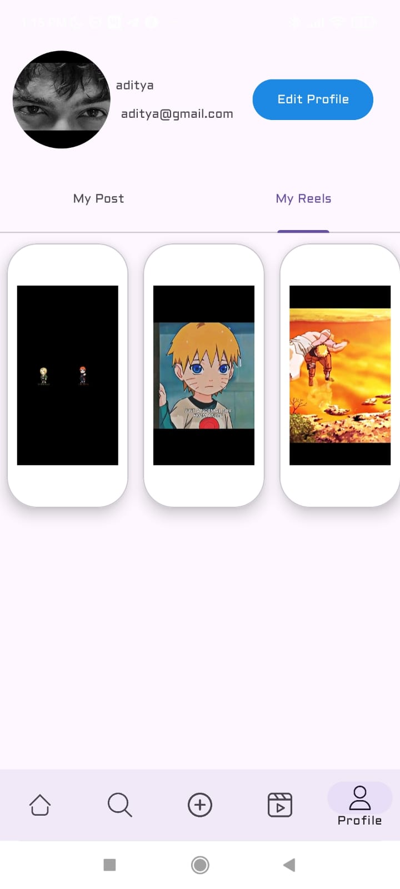
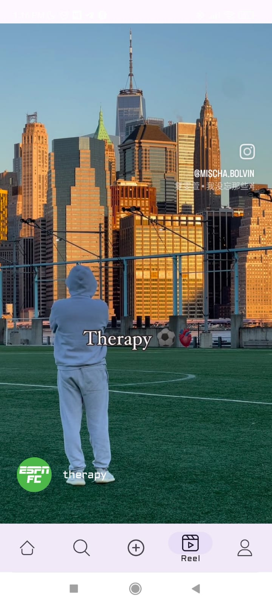
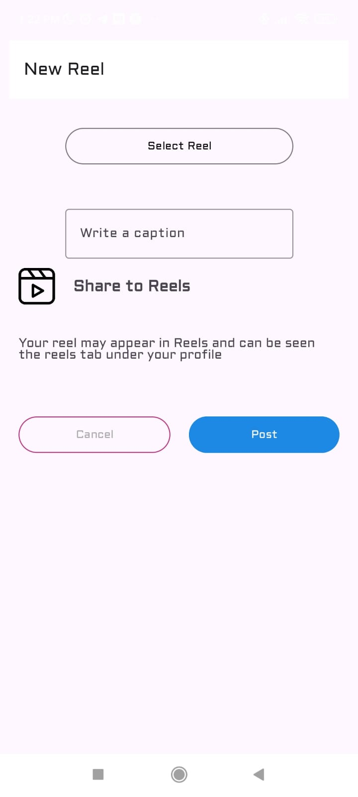
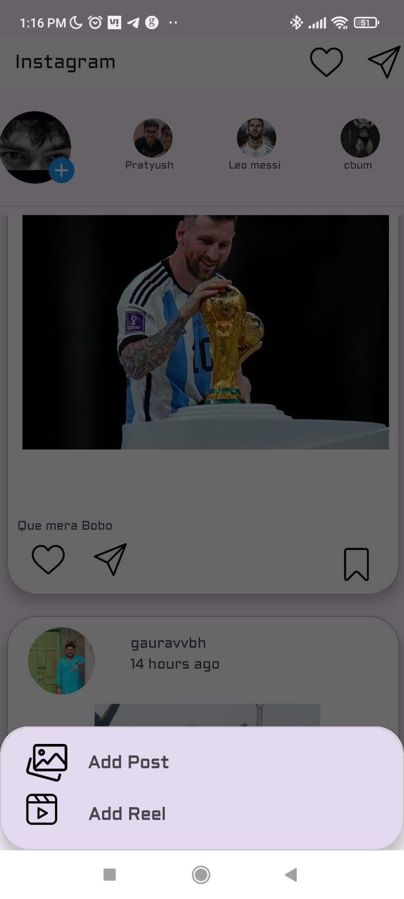
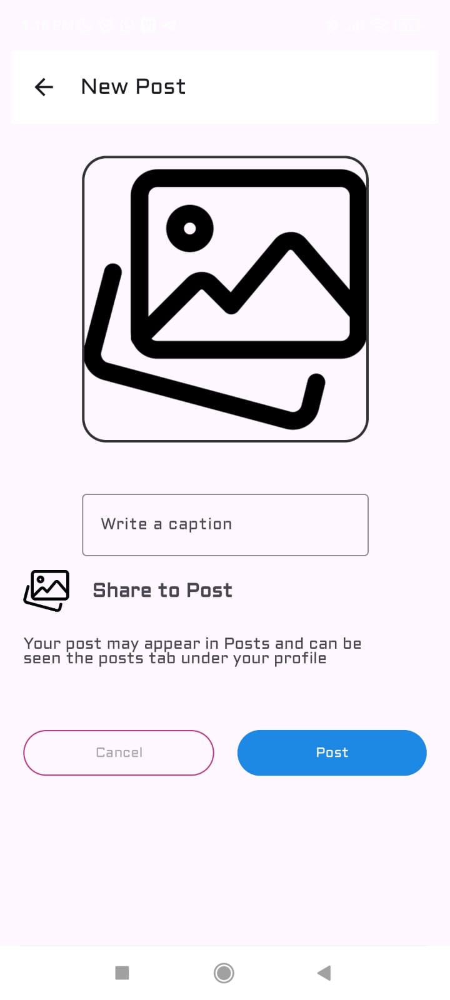
working of the app -> https://www.linkedin.com/posts/aditya-das-745043285_socialsync-kotlinapp-mobiledevelopment-activity-7180187738741108736-hQPa?utm_source=share&utm_medium=member_desktop

